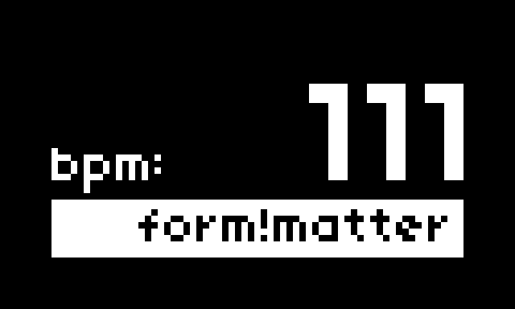
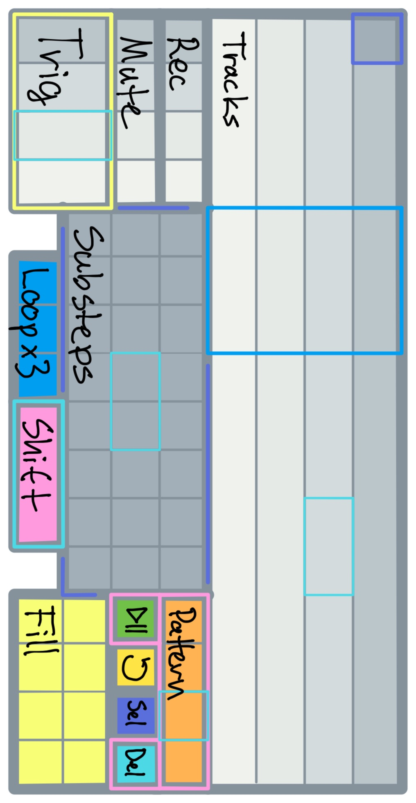

# form!matter





Form, without matter. A drum-sequencer for monome norns and grid.

Supports N.B. et al. (installed to /dust/code/nb) and crow.

Four tracks. 96 ppqn. Full access to every substep. Edit steps in time on the grid or program each substep as desired. Play unquantized. Multiple flavours of entropy on tap. Audio-rate fills.

*form!matter strives to be entropically inclusive.*  

Controls, norns:
```
enc 1: bpm  
enc 2: add(cw) random 16th steps or remove(ccw) steps  
enc 3: add(cw) random substeps or remove(ccw) substeps  
```
```
key 1: not used  
key 2: play/paus  
key 3: reset  
```
Controls, grid:


